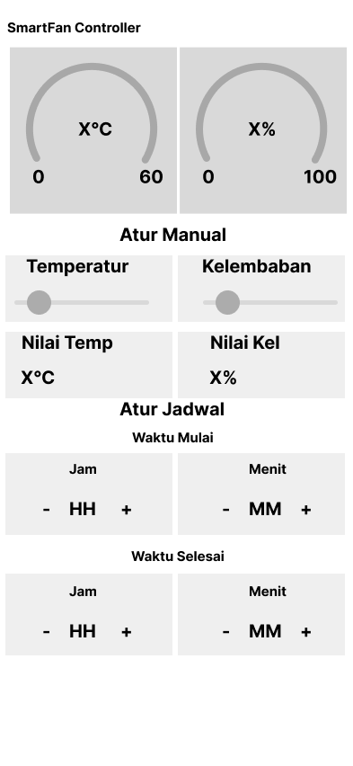

# Proyek Arduino dan ESP32

[](https://www.arduino.cc/)
[](https://www.espressif.com/)
[](https://blynk.io/)
[](https://wokwi.com/projects/433123236791603201)

> Smart Fan Controller berbasis ESP32 dengan monitoring suhu dan kelembaban melalui Blynk IoT

**Topics:** `arduino` `esp32` `iot` `smart-home` `blynk` `temperature-sensor` `humidity-sensor` `fan-control` `automation`

## Simulasi Online
Anda dapat mencoba dan menguji proyek ini secara online melalui [Wokwi Simulator](https://wokwi.com/projects/433123236791603201). Simulator ini memungkinkan Anda untuk:
- Melihat cara kerja sistem secara real-time
- Menguji logika kontrol kipas
- Memahami alur data sensor
- Memodifikasi parameter sesuai kebutuhan

## Deskripsi
Proyek ini berisi implementasi kode untuk Arduino dan ESP32 yang dapat digunakan untuk berbagai aplikasi IoT (Internet of Things). Proyek ini fokus pada pengembangan Smart Fan Controller yang dapat dikontrol melalui aplikasi Blynk IoT.

## Fitur Utama
- Monitoring suhu dan kelembaban secara real-time
- Kontrol kipas otomatis berdasarkan suhu dan kelembaban
- Mode manual dan otomatis
- Penjadwalan operasi kipas
- Dashboard monitoring melalui aplikasi Blynk
- Grafik tren suhu dan kelembaban

## Struktur Proyek
- `Arduino.ino` - Kode utama untuk Arduino
- `esp32.ino` - Kode untuk ESP32
- `panduan.md` - Dokumentasi panduan penggunaan
- `datastream.md` - Dokumentasi tentang aliran data

## Persyaratan
- Arduino IDE
- ESP32 board support package
- Library yang diperlukan:
  - Blynk IoT
  - DHT sensor library
  - ESP32 board support package
  - WiFi library

## Cara Penggunaan
1. Buka file `.ino` yang sesuai dengan board yang Anda gunakan di Arduino IDE
2. Pastikan board support package sudah terinstal
3. Upload kode ke board Anda
4. Ikuti panduan di `panduan.md` untuk konfigurasi lebih lanjut

## Diagram Alur
```
Arduino Uno ←→ UART ←→ ESP32 ←→ WiFi ←→ Blynk App
    ↓
Sensor DHT22, RTC, LCD, Relay
```

### Penjelasan Diagram:
- **Arduino Uno**: Menangani sensor dan aktuator lokal
- **UART**: Komunikasi serial antara Arduino dan ESP32
- **ESP32**: Menangani koneksi WiFi dan komunikasi dengan Blynk
- **WiFi**: Koneksi internet untuk komunikasi dengan Blynk
- **Blynk App**: Interface pengguna untuk monitoring dan kontrol
- **Sensor & Aktuator**:
  - DHT22: Sensor suhu dan kelembaban
  - RTC: Real Time Clock untuk penjadwalan
  - LCD: Display informasi lokal
  - Relay: Kontrol kipas

## Troubleshooting
1. Masalah Koneksi WiFi
   - Pastikan kredensial WiFi benar
   - Periksa kekuatan sinyal WiFi
   - Restart ESP32 jika diperlukan

2. Sensor Tidak Berfungsi
   - Periksa koneksi kabel sensor
   - Pastikan library DHT terinstal dengan benar
   - Verifikasi pin yang digunakan

3. Kipas Tidak Merespons
   - Periksa koneksi relay
   - Verifikasi pin output
   - Pastikan power supply mencukupi

## Dokumentasi
- Lihat `panduan.md` untuk panduan lengkap penggunaan
- Lihat `datastream.md` untuk informasi tentang aliran data

## Kontribusi
Silakan buat pull request untuk kontribusi. Untuk perubahan besar, harap buka issue terlebih dahulu untuk mendiskusikan perubahan yang diinginkan.

## Lisensi
[MIT](https://choosealicense.com/licenses/mit/)

## Skema dan Wireframe

### Skema Rangkaian


### Wireframe Aplikasi
 